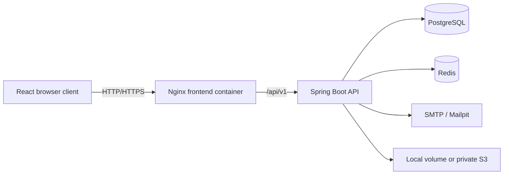

# Vantora CRM

Vantora CRM is a multi-tenant customer relationship management application. Organizations use separate workspaces to manage leads, customers, tasks, teammates, files, and pipeline reporting. The project uses a Java 21/Spring Boot API, a React 19 client, PostgreSQL, Redis, and Docker Compose for local development.

## Product capabilities

- Organization signup first creates an expiring pending registration; no tenant, user, or session exists until mailbox ownership is proven.
- Email verification creates the isolated tenant and its first verified `COMPANY_ADMIN` atomically; local Docker email is captured safely by Mailpit.
- Short-lived JWT access tokens stay in browser memory, while rotating refresh tokens use an HttpOnly cookie and server-side token-family replay protection.
- Role-based access control supports `SUPER_ADMIN`, `COMPANY_ADMIN`, `HR`, `RECRUITER`, and `EMPLOYEE`; tenant-facing onboarding assigns only tenant roles.
- Administrators can invite, update, and suspend teammates, with safeguards around protected administrator accounts.
- Leads support list and drag-and-drop Kanban views, ownership, value, source, search, filtering, sorting, and pagination.
- Customer profiles centralize contact and company information and support CSV export.
- Tasks provide board and list views, assignment, priority, due dates, overdue visibility, and scheduled email reminders.
- Dashboard analytics summarize pipeline value, lead conversion, workload, and recent activity.
- Tenant-scoped queries, cache keys, storage keys, and authorization checks keep workspace data separate.
- Redis caches read-heavy dashboard data and falls back to PostgreSQL if the cache is unavailable.
- Files use tenant and global quotas, bounded concurrent uploads, durable metadata, authenticated local downloads, and optional private Amazon S3 storage.
- OpenAPI documentation, validation responses, health endpoints, request IDs, and automated tests support development and maintenance.
- The responsive frontend includes profile, password, settings, help, loading, empty, error, and not-found states.

## Technology

| Area | Stack |
| --- | --- |
| Web client | React 19, TypeScript, Vite, Tailwind CSS, React Router, TanStack Query, Axios, React Hook Form, Recharts |
| API | Java 21, Spring Boot 3.5.16, Spring Security, Spring Data JPA/Hibernate, Maven |
| Data | PostgreSQL 17, Flyway, Redis 7.4 |
| Security | BCrypt, signed JWTs, rotating refresh-token families, email verification, tenant-scoped RBAC |
| Integrations | Spring Mail, Mailpit for local email, local storage, optional Amazon S3 |
| Delivery | Docker, Docker Compose, Nginx, GitHub Actions, Swagger/OpenAPI |

## Architecture



The browser never chooses a tenant ID for normal CRM operations. The API validates the access token, loads the current user and tenant, establishes a request-scoped tenant context, and requires tenant-qualified repository operations. See [Architecture](docs/architecture.md), [Security](docs/security.md), and [ADR 0001](docs/adr/0001-shared-schema-multitenancy.md).

## Quick start with Docker

### Prerequisites

- Docker Desktop with Docker Compose
- Host ports `3000` and `8025` available, or different `FRONTEND_PORT` and `MAILPIT_PORT` values in `.env`

### Start the complete application

From the repository root in PowerShell:

```powershell
.\scripts\init-env.ps1
docker compose up --build -d
docker compose ps
```

The initialization script creates an ignored `.env` file and inserts a unique, cryptographically random JWT signing key. The backend refuses to start without a sufficiently strong `JWT_SECRET`.

Open:

- Application: <http://localhost:3000>
- Local email inbox: <http://localhost:8025>
- Swagger UI through Nginx: <http://localhost:3000/swagger-ui.html>
- API health through Nginx: <http://localhost:3000/actuator/health>
- OpenAPI JSON through Nginx: <http://localhost:3000/v3/api-docs>

Choose **Create workspace**, submit the form, then open Mailpit and use the verification link in the newest message. Registration returns `201 Created` but deliberately does not start a session; sign in after verification.

Only Nginx publishes the application port in the full stack. The backend, PostgreSQL, and Redis remain on the private Compose network. Mailpit binds only to `127.0.0.1` and is a development inbox, not a production mail service.

View logs or stop the environment with:

```powershell
docker compose logs -f backend frontend
docker compose down
```

`docker compose down --volumes` also deletes the local PostgreSQL, Redis, upload, and Mailpit data volumes. Use it only when you intentionally want a clean environment.

If `.env` already exists, the initialization script stops instead of overwriting it. Use `-Force` only when you intentionally want a new local configuration and signing key.

## Run the API and frontend locally

Install Java 21, Maven, Node.js LTS, and npm. Docker can run PostgreSQL, Redis, and Mailpit while the API and frontend run on the host:

```powershell
.\scripts\init-env.ps1
docker compose -f compose.dev.yml up -d

$env:SPRING_DATASOURCE_URL = 'jdbc:postgresql://localhost:5433/mtcrm'
$env:SPRING_DATASOURCE_USERNAME = 'mtcrm'
$env:SPRING_DATASOURCE_PASSWORD = 'mtcrm_dev_password'
$env:SPRING_DATA_REDIS_HOST = 'localhost'
$env:SPRING_DATA_REDIS_PORT = '6380'
$env:JWT_SECRET = '<copy JWT_SECRET from .env>'
$env:MAIL_ENABLED = 'true'
$env:MAIL_HOST = 'localhost'
$env:MAIL_PORT = '1025'
$env:APP_FRONTEND_BASE_URL = 'http://localhost:5173'
$env:APP_PUBLIC_BASE_URL = 'http://localhost:5173'
Set-Location backend
mvn spring-boot:run
```

In a second terminal:

```powershell
Set-Location frontend
npm install
npm run dev
```

The development client runs at <http://localhost:5173> and proxies `/api` to the local backend at `http://localhost:8080`. Mailpit is at <http://localhost:8025>. The dependency-only stack binds PostgreSQL on `127.0.0.1:5433`, Redis on `127.0.0.1:6380`, and SMTP on `127.0.0.1:1025` to avoid common locally installed defaults without exposing development services to the LAN.

## Configuration

Generate `.env` with `.\scripts\init-env.ps1`; `.env` is ignored by Git. Checked-in values are local-development defaults only.

| Variable | Purpose | Local behavior |
| --- | --- | --- |
| `POSTGRES_DB`, `POSTGRES_USER`, `POSTGRES_PASSWORD` | PostgreSQL database and credentials | Development-only values |
| `POSTGRES_PORT` | PostgreSQL host port for `compose.dev.yml` | `5433` |
| `DB_POOL_SIZE` | Maximum backend database connections | `15` |
| `REDIS_PORT` | Redis host port for `compose.dev.yml` | `6380` |
| `FRONTEND_PORT` | Nginx/application host port | `3000` |
| `MAILPIT_PORT`, `MAILPIT_SMTP_PORT` | Local inbox UI and IDE SMTP ports | `8025`, `1025` |
| `APP_CORS_ALLOWED_ORIGINS` | Exact trusted browser origins | Local client origins |
| `APP_FRONTEND_BASE_URL`, `APP_PUBLIC_BASE_URL` | Links emitted in email and file responses | Local web URL |
| `JWT_SECRET` | Required HMAC signing key | Generated uniquely by `init-env.ps1` |
| `JWT_ACCESS_TOKEN_TTL`, `JWT_REFRESH_TOKEN_TTL`, `JWT_ACTION_TOKEN_TTL` | Session and action-token lifetimes | `15m`, `7d`, `30m` |
| `COOKIE_SECURE`, `COOKIE_SAME_SITE` | Refresh-cookie transport policy | Local HTTP-compatible values |
| `MAIL_ENABLED`, `MAIL_*` | SMTP delivery | Full Compose uses Mailpit |
| `STORAGE_PROVIDER` | `local` or `s3` | `local` |
| `STORAGE_MAX_*` | Tenant/global byte, file, hourly, and concurrency limits | Bounded local defaults |
| `AWS_REGION`, `AWS_S3_BUCKET`, `AWS_S3_ENDPOINT` | S3 region, required bucket when `STORAGE_PROVIDER=s3`, and optional compatible endpoint | Bucket required only for S3 mode |
| `AWS_ACCESS_KEY_ID`, `AWS_SECRET_ACCESS_KEY` | S3 credentials | Empty; prefer workload identity in production |
| `AUTH_RATE_LIMIT`, `AUTH_RATE_WINDOW_SECONDS` | Per-process authentication throttle | `20` per `60` seconds |
| `REMINDER_CRON` | Six-field Spring reminder schedule | Hourly |

Production must inject secrets from its secret manager, terminate TLS at a trusted edge, restrict CORS, use managed PostgreSQL and Redis, use a real transactional email provider, and enable secure cookies. See [Deployment guidance](docs/deployment.md).

## Testing and quality checks

Backend:

```powershell
Set-Location backend
mvn clean verify
```

Frontend:

```powershell
Set-Location frontend
npm ci
npm run lint
npm test
npm run build
```

Infrastructure, with `JWT_SECRET` set or a generated `.env` present:

```powershell
docker compose config --quiet
docker compose -f compose.dev.yml config --quiet
```

GitHub Actions runs backend and frontend checks, then starts the complete Compose stack for integration tests. Those tests cover Flyway migrations, onboarding and email verification, session rotation, customer creation, CSV export, file upload and download, tenant isolation, and edge throttling. The workflow does not deploy the application.

## API and developer tools

- Swagger UI for full Compose: <http://localhost:3000/swagger-ui.html>
- OpenAPI JSON for full Compose: <http://localhost:3000/v3/api-docs>
- Direct local API: <http://localhost:8080/api/v1>
- Endpoint guide: [docs/api.md](docs/api.md)
- Test strategy: [docs/testing.md](docs/testing.md)
- Data model: [docs/erd.md](docs/erd.md)
- Architecture decisions: [docs/adr/README.md](docs/adr/README.md)
- Importable Postman collection: [postman/MT-CRM.postman_collection.json](postman/MT-CRM.postman_collection.json)
- Local Postman environment: [postman/Local.postman_environment.json](postman/Local.postman_environment.json)

The Postman collection models the secure onboarding sequence: register, copy the verification token from the Mailpit message, verify, then log in. Login and refresh save the access token; the refresh token stays in Postman's cookie jar.

## Repository layout

```text
MT-CRM/
├── backend/                 Spring Boot API, Flyway schema, and tests
├── frontend/                React client, UI tests, and Nginx proxy
├── docs/                    Architecture, API, security, testing, and deployment notes
├── postman/                 Collection and local environment
├── scripts/                 Safe local configuration initialization
├── .github/workflows/       Continuous integration
├── compose.dev.yml          PostgreSQL, Redis, and Mailpit for local development
└── docker-compose.yml       Complete containerized application
```

## Security and tenant isolation

- Passwords are one-way hashed and never returned by the API.
- Login requires a verified email; verification and password-reset tokens are single-use.
- Access tokens are short-lived. Refresh tokens are hashed at rest, rotated, grouped into session families, and revoked on replay or logout.
- Tenant IDs come from the verified principal, not a client-controlled header or CRUD body.
- Repository operations include tenant ownership in their lookup criteria.
- Authorization combines role checks with tenant-scoped resource and reference validation.
- Nginx replaces forwarded-client headers at the trust boundary; the full stack does not expose the backend directly.
- Authentication endpoints are bounded and rate-limited in process; production should add distributed edge enforcement.
- Uploads enforce declared content-type and size limits, quotas, concurrency limits, and tenant ownership. File-byte signature validation is not implemented.
- Validation failures use safe problem responses without stack traces.

The detailed trust boundaries and deployment controls are in [docs/security.md](docs/security.md).

## Manual verification

1. Register workspace A, open its Mailpit verification link, and sign in.
2. Add leads, move them through the pipeline, and observe dashboard metrics update.
3. Create a customer, assign a lead-related follow-up task, and filter tasks by priority or status.
4. Invite a teammate and use the local email to complete onboarding; demonstrate role restrictions.
5. Register and verify workspace B in a private browser session, then demonstrate that workspace A identifiers remain inaccessible.
6. Reload after access-token expiry to demonstrate coordinated refresh-cookie renewal, then inspect Swagger UI, Flyway history, and automated checks.

## Contributing and responsible disclosure

Read [CONTRIBUTING.md](CONTRIBUTING.md) before opening a change. Report security issues privately according to [SECURITY.md](SECURITY.md), never in a public issue.

This project is provided under the [MIT License](LICENSE).
