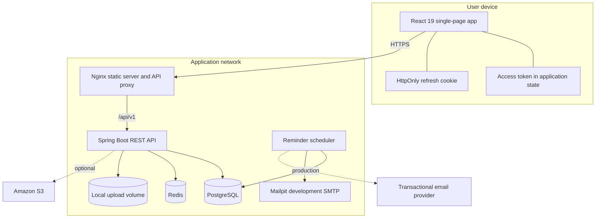
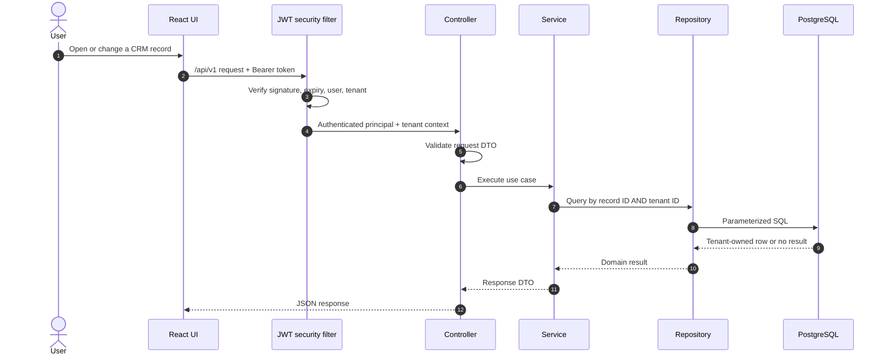

# Architecture

## Design goals

Vantora CRM is a modular monolith: it keeps one deployable API while drawing explicit boundaries between authentication, tenant administration, leads, customers, tasks, dashboards, notifications, and storage. This shape is simpler to operate than premature microservices and still makes future extraction possible because modules communicate through services and DTOs rather than reaching into each other's controllers.

The architecture prioritizes:

1. tenant isolation on every data access path;
2. secure, revocable browser sessions;
3. a responsive UI even when lists grow;
4. repeatable schema and container startup;
5. observable failure instead of silent corruption; and
6. one-command local onboarding.

## Runtime topology

In the full Docker stack, only the frontend/Nginx container publishes the application on port `3000`; the backend, PostgreSQL, and Redis are reachable only on the private Compose network. Nginx overwrites client-supplied forwarding headers before proxying to the API, which trusts framework forwarding only behind that boundary. Mailpit binds its development inbox to loopback port `8025`. The dependency-only development stack additionally binds PostgreSQL on `127.0.0.1:5433`, Redis on `127.0.0.1:6380`, and Mailpit SMTP on `127.0.0.1:1025` for IDE workflows.

## Backend request path

The controller does not receive a trusted tenant ID from the request. The security layer derives it from the verified identity, and repositories require that tenant scope for tenant-owned records. A missing row and a row in another tenant are intentionally indistinguishable to the caller.

## Backend module boundaries

| Module | Responsibility |
| --- | --- |
| `auth` / `security` | Registration, email verification/resend, login, JWT verification, refresh-family rotation, password reset, logout, security principal |
| `tenant` | Organization identity and request-scoped tenant context |
| `user` | Team members, roles, status, profile administration |
| `lead` | Lead lifecycle, stage, source, ownership, value, search |
| `customer` | Customer and company contact records |
| `task` | Follow-up work, assignments, priority, due dates, completion |
| `dashboard` | Aggregated metrics and cache policy |
| `notification` | Reminder scheduling and optional email delivery |
| `storage` | Local development uploads and optional S3 implementation |
| `common` | Auditing, pagination, validation errors, exception mapping |

JPA entities remain inside the API implementation. Public API contracts use request and response DTOs so database changes do not silently become wire-format changes.

## Frontend boundaries

The React application separates four concerns:

- **App shell and routing:** protected routes, responsive navigation, error boundary, and page layout.
- **Server state:** Axios performs HTTP requests; TanStack Query owns caching, refetching, mutations, and invalidation.
- **Forms:** React Hook Form and schema validation own user input and field errors.
- **Presentation:** Tailwind-based feature components render tables, cards, dialogs, pipeline views, charts, and accessible states.

The access token is attached by an Axios interceptor and remains in memory. A single refresh operation is shared when concurrent requests receive `401`, preventing a refresh stampede; browser tabs coordinate refresh through the Web Locks API where available. After a successful refresh, the original requests retry once. A failed refresh clears session state and tenant-specific query caches before returning the user to sign-in.

Registration is intentionally not an authentication operation. The API stores only an expiring pending registration and sends a single-use verification token; it creates no tenant, user, cookie, or access token. Verification locks and consumes that pending record, rechecks deployment quotas, and atomically creates the tenant and its verified administrator. Only a verified, active user in an active tenant can log in, refresh, or use an access token. Local Docker sends these messages to Mailpit so onboarding can be exercised without external credentials.

## Data and consistency

PostgreSQL is the source of truth. Flyway applies ordered migrations before the application accepts traffic. Tenant-owned tables carry a non-null tenant foreign key and composite indexes that start with `tenant_id` for common access patterns.

Redis stores derived dashboard responses, never authoritative CRM records. Cache keys include the authenticated tenant. Commands that change leads, customers, or tasks evict the affected dashboard data. PostgreSQL remains the source of truth, and an explicit cache error handler logs Redis failures and continues against PostgreSQL rather than failing core requests.

File metadata is also authoritative in PostgreSQL. Uploads first reserve quota in a short transaction, perform object-storage I/O without holding the global quota lock, and then activate or fail the reservation. Per-tenant and global byte/file/hourly limits, a process-level concurrency bound, and scheduled stale-reservation cleanup limit resource exhaustion. Local content requests validate active metadata and tenant ownership; S3 detail requests generate a fresh short-lived presigned URL.

## Asynchronous work

Reminder scanning is paged and protected by a PostgreSQL-backed ShedLock so only one application instance claims a batch. Each batch takes at most one task per workspace and stores the tenant's last-served time, rotating fairly across runs even when more than 50 tenants have old backlogs. Eligible tasks require an active tenant plus an active, verified assignee. Claim and result updates use short database transactions; SMTP calls occur outside the claiming transaction and failed deliveries are moved to a later retry so one recipient cannot starve the queue. Mailpit supplies local SMTP; production must use a monitored transactional provider. A dedicated outbox and worker remains the natural next step for higher-volume, business-critical delivery guarantees.

## Scalability path

- Keep API instances stateless; session state resides in signed tokens, PostgreSQL, and Redis.
- Scale API and frontend containers horizontally behind a TLS load balancer.
- Use managed PostgreSQL with connection pooling, backups, read monitoring, and tested restore procedures.
- Use managed Redis with authentication and network isolation.
- Enable the S3 storage profile for private objects and 15-minute presigned download URLs; add a CDN only when traffic requires it.
- Add an outbox and worker service before extracting notifications or analytics.
- Partition or archive high-volume audit data only when measurements justify it.

The shared-schema tenancy choice is recorded in [ADR 0001](adr/0001-shared-schema-multitenancy.md), and the browser-session design in [ADR 0002](adr/0002-refresh-token-rotation.md).
