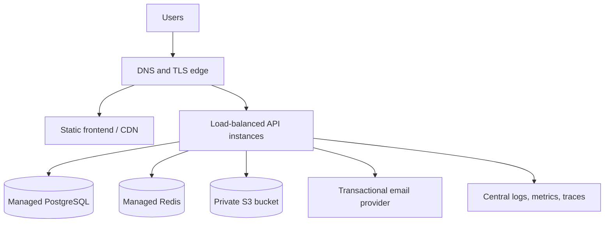

# Deployment guidance

Docker Compose is the local reference environment, not a complete production platform. A production deployment should use managed data services and an orchestrator or application platform that supplies TLS, secrets, health-based rollout, logging, and backups.

## Recommended topology

The frontend can be deployed as immutable Nginx containers or static assets on object storage/CDN. Route `/api/v1` to the API under the same site origin when possible; this simplifies cookie and CORS policy.

## Release sequence

1. Run `mvn clean verify`, frontend lint/test/build, and container builds in CI.
2. Scan dependencies and images; produce immutable version tags.
3. Back up PostgreSQL and verify the migration is compatible with the currently running version.
4. Apply backward-compatible Flyway migrations through one controlled API instance or a dedicated migration job.
5. Roll out API instances gradually and wait for readiness/health checks.
6. Publish the frontend built against the correct API base URL.
7. Run smoke tests for registration, email verification, login, refresh, tenant isolation, CRUD, file access, and health.
8. Observe error rate, latency, connection pools, migrations, and business flows before completing the rollout.

## Required environment changes

- Inject a generated JWT signing secret and database password through the platform secret manager. `JWT_SECRET` is mandatory; never ship the local generated `.env`.
- Set CORS to exact HTTPS application origins.
- Enable secure refresh cookies through the production Spring profile.
- Configure managed PostgreSQL and Redis endpoints; do not expose either publicly.
- Enable framework forwarding only when the API accepts traffic exclusively from a trusted proxy that replaces untrusted forwarding headers.
- Set `MAIL_ENABLED=true` only after transactional SMTP credentials, verified sender, timeouts, and failure monitoring are ready. Never deploy Mailpit as the production mail service.
- Set `STORAGE_PROVIDER=s3`, provide a valid region and non-empty private bucket (startup fails fast otherwise), and prefer an instance/workload role over static AWS keys. Any compatible endpoint must be an absolute HTTP(S) URL without embedded credentials, query, or fragment.
- Set tenant and global storage quotas from measured capacity, keep the upload concurrency bound, and add provider-side lifecycle and scanning controls.
- Keep development actuator details disabled; expose only health probes to untrusted networks.

## Database migrations

Flyway migrations are append-only. Avoid a migration that breaks the currently running API during a rolling update. Use an expand-and-contract sequence for renames and destructive changes:

1. add the new structure while keeping the old structure;
2. deploy code that can work during the transition;
3. backfill and verify data;
4. switch all reads/writes to the new structure; and
5. remove old structure in a later release.

## Backup and recovery

Enable automated backups and point-in-time recovery for PostgreSQL. Encrypt backups, restrict restore permissions, and conduct a timed restore drill. Redis caches need not be restored for correctness; refresh-session storage in PostgreSQL remains authoritative. Define recovery-time and recovery-point objectives before onboarding real users.

## Scaling and reliability

- Run at least two API instances across failure zones for a serious production service.
- Set JVM memory limits and monitor heap, garbage collection, thread pools, and database connection pools.
- Configure connect/read timeouts and bounded retries for SMTP, S3, PostgreSQL, and Redis.
- Treat Redis as an optimization: cache failures should not bypass authorization or corrupt source data.
- Monitor ShedLock ownership, reminder retry age, and failed deliveries. Add a transactional outbox before relying on email delivery for business-critical guarantees.
- Use readiness probes to stop traffic during startup/migrations and liveness probes only for unrecoverable hangs.

## Local reference environment

Create local configuration with `.\scripts\init-env.ps1`, then start the full stack with `docker compose up --build -d`. Nginx publishes port `3000`; the API, PostgreSQL, and Redis stay on the private Compose network. Mailpit publishes a loopback-only development inbox on `8025`. This topology exercises same-origin API routing, Flyway against PostgreSQL, Redis integration, SMTP delivery, and local object metadata without treating Compose as a production platform.

## Rollback

Roll back the application image only when the migrated schema remains compatible. Never automatically reverse a destructive database migration. If a release wrote data in a new format, prefer a forward fix with feature flags and tested data repair over an unsafe binary rollback.
