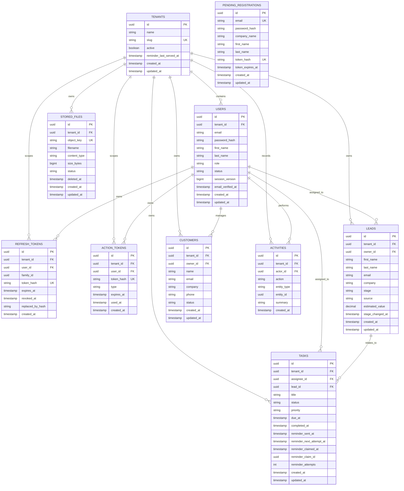

# Data model

The schema uses UUID-style identifiers, UTC timestamps, foreign keys, and explicit indexes. Exact column details live in the Flyway migrations; this diagram communicates ownership and cardinality.

## Data rules

- User email is globally unique because email is the platform login identity; CRM contact email fields are not authentication identities.
- Lead, customer, and task indexes begin with `tenant_id` and then the fields used for filtering or ordering.
- Deletes should preserve auditability where the product needs history; prefer status transitions or soft deletion for customer records after defining retention rules.
- Money values use fixed-precision decimals and an explicit currency policy.
- Application timestamps use UTC; the frontend formats them in the user's locale.
- Refresh tokens contain no recoverable secret in the database—only a digest suitable for lookup and comparison.
- Pending registrations have no tenant relationship: tenant and user rows are created only after a single-use mailbox-verification token is consumed.
- Refresh records carry a family ID and fixed absolute family expiry so replay containment revokes one compromised session chain without terminating independent device sessions or creating immortal sliding sessions.
- User session versions invalidate outstanding access and refresh credentials immediately after password, role, or status changes.
- Stored-file metadata moves through `PENDING`, `ACTIVE`, `FAILED`, and `DELETED` states. Quota calculations include reservations, while downloads require an active tenant-owned row.
- The singleton `storage_quota_lock` row serializes short global quota reservations, and the `shedlock` table coordinates scheduled work across API instances.
