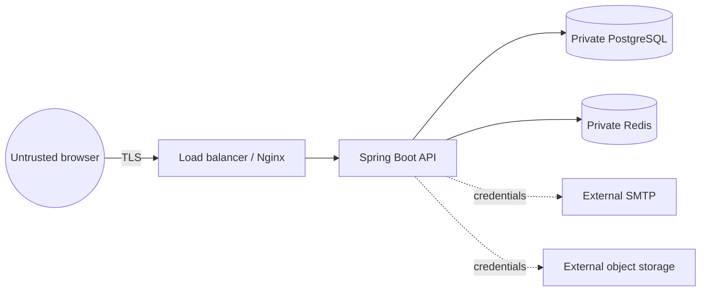

# Security model and threat notes

This document is an engineering threat review, not a compliance certification. It describes the intended controls and highlights controls that the deployment platform must add.

## Trust boundaries

Browser input, bearer tokens, uploaded filenames, email contents, and third-party responses are untrusted. PostgreSQL and Redis are private application dependencies; they must never be published to the public internet.

The full Docker stack exposes application traffic through Nginx only. The backend has no host port, and Nginx replaces client-supplied `X-Forwarded-*` values and clears the standardized `Forwarded` header before proxying. Any production topology that enables framework forwarding must preserve the same trusted-proxy boundary.

## Threats and controls

| Threat | In-application control | Deployment or follow-up control |
| --- | --- | --- |
| Cross-tenant record access | Tenant comes from the verified principal; owned queries include tenant ID; two-tenant tests | Code review tenant query paths; consider PostgreSQL RLS as defense in depth |
| Broken role authorization | Spring Security rules plus tenant-scoped service and reference checks | Maintain a role/permission matrix and test every privileged endpoint |
| Account squatting / unverified signup | Registration creates no session; login and refresh require a verified address; verification can be resent without revealing account existence | Monitor abuse, expire abandoned registrations, and consider proof-of-work/CAPTCHA only when measurements justify it |
| Password theft | BCrypt hashing, password policy, bounded in-process auth rate limit; passwords excluded from DTOs/logs | Add distributed edge rate limits, breached-password checks, and optional MFA |
| Access-token theft | Short expiry and signature validation | TLS, CSP, XSS prevention, secret rotation, incident revocation procedure |
| Refresh-token theft/replay | HttpOnly cookie, hashed persistence, expiry, atomic rotation, and family-scoped replay revocation | `Secure` cookie, session view/revoke, key rotation, and risk signals |
| CSRF | Bearer token for normal mutations; `SameSite` refresh cookie and origin-aware CORS | Validate `Origin` on cookie endpoints; add CSRF token if cross-site cookie mode is ever required |
| XSS | React escapes text by default; no token in persistent browser storage | Strict CSP, dependency patching, avoid unsafe HTML, sanitize any future rich text |
| SQL injection | Parameterized JPA repository queries and validated sort allowlists | Static analysis and review custom/native queries |
| Search/read resource exhaustion | Nginx applies a bounded per-client API request rate and every list is paginated | Add identity-aware distributed edge limits and query observability before internet-scale deployment |
| Mass assignment | Request DTO allowlists; entities are not request bodies | Add tests when new privileged fields are introduced |
| File upload abuse | Nginx body and per-client request limits, generated object keys, content/size validation, tenant/global quotas, concurrency bound, durable metadata, private S3 URLs | Malware scanning, provider-side quotas, lifecycle/retention rules, and managed edge limits |
| Cache data leak | Cache keys include tenant identity; source of truth remains tenant-scoped PostgreSQL | Separate environments, authenticated private Redis, avoid caching sensitive secrets |
| Sensitive logging | Consistent safe errors; no credentials in intended logs | Central log redaction, limited access, retention, alerting |
| Brute force / resource exhaustion | Bounded per-client API/auth throttles, exact auth-path matching, pagination, upload quotas/concurrency, and bounded request validation | Managed distributed edge limits, request/header/body limits, circuit breakers, and autoscaling |
| Duplicate or stuck reminder jobs | PostgreSQL-backed scheduler lock, bounded claiming, eligibility checks, and delayed retries outside the claim transaction | Alerting, dead-letter inspection, provider idempotency, and a transactional outbox at higher scale |
| Proxy-header spoofing | Backend hidden in full Compose; Nginx overwrites forwarding headers; direct runs do not trust forwarded headers by default | Allow traffic only from trusted proxies and test the deployed ingress chain |
| Dependency or image compromise | Locked npm tree, Maven verification, CI container builds | Dependabot/Renovate, SBOM, image scanning/signing, pinned production digests |

## Authorization invariants

1. Authentication identifies a user and tenant together.
2. A disabled user or tenant cannot refresh a session.
3. An unverified user cannot obtain or refresh an authenticated session.
4. A valid record ID or storage key alone never authorizes access.
5. An administrator is powerful only inside their tenant; tenant administrators cannot manage platform super administrators.
6. Updating an assignee verifies that the assignee belongs to the same tenant.
7. Aggregate, search, activity, cache, and file queries use the same tenant boundary as single-record queries.
8. A forbidden or cross-tenant identifier does not reveal whether the record exists.

## Secret handling

The checked-in `.env.example` deliberately leaves `JWT_SECRET` empty. `.\scripts\init-env.ps1` creates an ignored `.env` file with a unique random value; application startup fails when the secret is absent, too short, or a known placeholder. A deployed environment should read secrets from a managed secret store or injected environment variables. Never place secrets in frontend `VITE_*` values because they are compiled into browser assets.

Rotate the JWT signing secret by introducing key identifiers and accepting the previous verification key during a controlled transition. Rotate database, SMTP, and cloud credentials according to the provider's process and restart affected workloads without logging values.

## Production hardening checklist

- [ ] HTTPS is enforced and HTTP redirects without serving application content.
- [ ] Refresh cookies use `Secure`, `HttpOnly`, and the narrowest practical path and SameSite policy.
- [ ] CORS contains exact deployed origins, never `*` with credentials.
- [ ] PostgreSQL and Redis have no public route and require strong credentials/TLS where supported.
- [ ] Only the intended edge can reach an API configured to trust forwarded headers.
- [ ] S3 blocks public access and grants only the required prefix/actions to the workload role.
- [ ] Edge limits cover auth attempts, request rate, upload size, header size, and timeouts.
- [ ] Verification, password-reset, and reminder email use a monitored transactional provider; Mailpit is not deployed.
- [ ] CSP, frame restrictions, MIME sniffing protection, and referrer policy are set at the edge.
- [ ] Database backups, point-in-time recovery, and a restore drill are complete.
- [ ] Dependency, container, and secret scanning run continuously.
- [ ] Logs, metrics, and alerts cover authentication anomalies, `5xx` rates, latency, connection pools, cache health, and failed jobs.
- [ ] Data retention, deletion, export, and incident-response procedures are documented.
